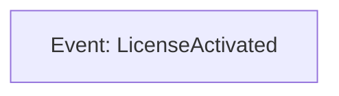
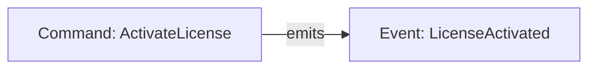
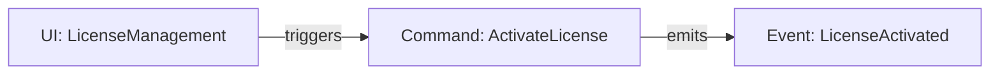
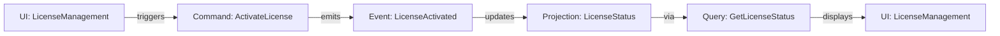
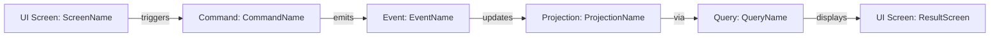
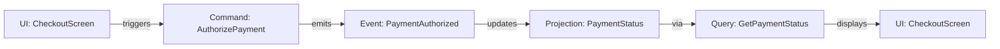
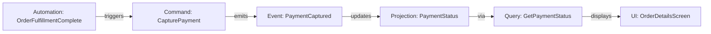

# Event Modeling Process

**This document describes the Event Modeling methodology. Individual step agents have detailed instructions in their own configurations. The main coordinator agent orchestrates the 12-step process.**

## CRITICAL: Collaboration-First Event Modeling

**ALL event modeling work happens collaboratively in the main conversation with active user participation.**

### How Event Modeling Collaboration Works

**Event Modeling Step Agents (event-modeling-step-* agents):**
- WRITE event model documentation directly using Write/Edit tools
- Research existing requirements and event model context
- Analyze event model completeness and consistency
- After user approves changes, RE-READ files to see user modifications
- Acknowledge user changes and answer QUESTION: comments
- See `~/.config/opencode/instructions/COLLABORATION_PROTOCOLS.md` for complete protocols

**Main Conversation Coordinates:**
- Launches step agents via Task tool for each step
- Provides context and instructions to step agents
- Facilitates user review using the collaboration workflow (requesting manual edits or approval)
- Encourages the user to add `QUESTION:` comments when clarification is needed
- Ensures step agents re-read after feedback and respond to questions
- User is co-creator, not rubber-stamp approver

**User Participates:**
- Reviews all event model recommendations
- Modifies proposed event models directly in files or issue trackers
- Adds `QUESTION:` comments inline for clarification
- Makes final decisions on event model structure
- Collaborates iteratively on refinement

### QUESTION: Comment Mechanism

During event modeling, user can add inline questions:

```markdown
## Event: PaymentCaptured

### Data Fields
- transaction_id: String
QUESTION: Should this be a UUID or allow arbitrary strings?
```

Main conversation answers the question inline and removes QUESTION: prefix once resolved.

### Change Review Loop

1. Main conversation summarizes the proposed event model update
2. User reviews the relevant files, makes edits, or raises `QUESTION:` comments
3. Main conversation (or the active agent) acknowledges modifications and discusses trade-offs
4. Iterate using the collaboration workflow until the event model is correct

**See `COLLABORATION_PROTOCOLS.md` for the detailed collaboration workflow.**

## Overview

Event Modeling is a collaborative design methodology that captures system behavior through events, commands, and data flow. This process creates living documentation that serves as both design specification and implementation guide.

## CRITICAL: Understanding "Event Model" vs "Event"

**An event model is an END-TO-END BUSINESS JOURNEY containing multiple events that represent state changes.**

### Event Model (The Journey)
- **Complete business journey**: Represents ENTIRE path from initial trigger to terminal state
- **Contains multiple events**: Each event within the model represents a distinct business decision or state change
- **Single document**: One markdown file per event model showing all events in sequence
- **Single path**: Each model follows ONE decision path - branches require separate models or alternative path models

### Event (The State Change)
- **Domain-specific**: Named with business semantics (e.g., `EngagementOnboardingTaskCompleted`, not `TaskUpdated`)
- **Separate document**: Each event has its own markdown file (can appear in multiple models)
- **Business decision**: Represents judgment or decision made by responsible party
- **Triggers consequences**: May unblock dependencies, trigger automation, update projections
- **Persistent state**: Survives system restart, recorded indefinitely

### Key Distinction

**WRONG (treating events as separate models):**
- Model #1: "Initiate engagement onboarding"
- Model #2: "Complete engagement onboarding task"

**RIGHT (events within single model):**
- **Model: "Manage engagement onboarding"** containing events:
  - `EngagementOnboardingInitiated`
  - `EngagementOnboardingTaskCompleted` (repeats N times)
  - `EngagementOnboardingCompleted`

**Examples of Event Models:**
- ✅ "Manage engagement onboarding" (initiation → N task completions → completion)
- ✅ "Process and index PDF document" (S3 upload → extraction → chunking → embedding → indexed)
- ✅ "Approve time-off request" (request submitted → manager reviews → approved/denied)
- ❌ "Complete a task" (too narrow - this is an EVENT within a model, not a complete journey)

## CRITICAL: Event Models Must Represent State Changes

**Event modeling represents how state changes affect views. An event model exists ONLY when users record decisions in the system.**

### The Core Question

**"If X happens, what affect does that have on view Y?"**

- If no effect → Not an event model, just a query
- If view changes → Need event model with events → projections → updated views

### What IS an Event Model (State Changes)

✅ **User records a decision or creates persistent state:**
- "Deploy and configure system" → SystemActivated, ConfigurationApplied
- "Establish organizational hierarchy" → UnitCreated (multiple), LeaderAssigned
- "Model resource scenario" → ScenarioCreated, ScenarioCommittedToPlan
- "Onboard new customer" → OnboardingInitiated, TaskCompleted, OnboardingFinished
- "Flag operational risk" → RiskFlagged, RiskMitigated
- "Request and approve leave" → LeaveRequested, LeaveApproved

### What is NOT an Event Model (Read-Only)

❌ **User only views information without changing it:**
- "View resource availability" - just a query against projections
- "View team roster" - just a query against projections
- "Monitor system health" - just reading metrics/logs
- "Review audit trail" - just reading event history
- "View schedule calendar" - just a query against projections
- "Detect capacity issue" - automated alert (no user decision recorded)

**If a user logs in, views information, and logs out without changing anything → NO EVENT MODEL EXISTS**

### Anti-Pattern: CRUD Thinking

❌ **Avoid modeling individual CRUD operations as separate event models:**

**WRONG (separate models for each CRUD operation):**
- Model #1: "Create organizational unit"
- Model #2: "Rename organizational unit"
- Model #3: "Move organizational unit"
- Model #4: "Archive organizational unit"

**RIGHT (single model covering business journey):**
- **Model: "Establish organizational hierarchy"** containing events:
  - `OrganizationalUnitCreated` (repeats for each unit)
  - `OrganizationalUnitRenamed` (when needed)
  - `OrganizationalUnitMoved` (when restructuring)
  - `OrganizationalUnitArchived` (when consolidating)

**WRONG (separate models for configuration steps):**
- Model #1: "Define category types"
- Model #2: "Define levels within category"
- Model #3: "Apply template configuration"

**RIGHT (single model covering complete setup):**
- **Model: "Configure classification framework"** containing events:
  - `CategoryTypeDefined` (repeats for each type)
  - `CategoryLevelDefined` (repeats for each level)
  - `TemplateApplied`
  - `CategorySettingsCustomized`

### Anti-Pattern: Confusing Events with Event Models

❌ **Avoid creating separate event models for each event in a journey:**

**WRONG (treating events as models):**
- Model #1: "Initiate engagement onboarding"
- Model #2: "Complete engagement onboarding task"
- Model #3: "Finish engagement onboarding"

**RIGHT (events within single model):**
- **Model: "Manage engagement onboarding"** containing events:
  - `EngagementOnboardingInitiated`
  - `EngagementOnboardingTaskCompleted` (repeats N times)
  - `EngagementOnboardingCompleted`

### Anti-Pattern: View-Only "Event Models"

❌ **Avoid creating event models for read-only activities:**

**NOT event models (just queries):**
- "View quarterly forecast"
- "View team schedule"
- "View report history"
- "Track process progress"

These are **projections and queries**, not event models. They appear on UI screens but don't generate events.

### How to Identify Real Event Models

**Ask these questions:**

1. **Does the user RECORD decisions?** (Yes → event model | No → just queries)
2. **What persistent state changes occur?** (Events that survive restart)
3. **What's the END-TO-END journey?** (From trigger to completion)
4. **What events mark progress?** (Each meaningful state change is an event within the model)
5. **Where does the journey split?** (Different outcomes = separate models or alternative paths)

**Examples of proper event model identification:**

**Resource Planning functional area:**
- ❌ NOT: "View resource forecast", "View availability", "Simulate allocation"
- ✅ YES: "Model resource scenario", "Flag planning risk", "Commit resource plan"

**Customer Management functional area:**
- ❌ NOT: Individual event models for "Create template", "Customize template", "Complete task"
- ✅ YES: "Onboard new customer" (containing template creation, task completion, onboarding completion events)

**System Configuration functional area:**
- ❌ NOT: Separate models for "Create entity", "Rename entity", "Move entity"
- ✅ YES: "Establish organizational structure" (containing all entity lifecycle events)

### Functional Areas Without Event Models

**Some functional areas may have NO event models** - they only provide projections/queries built from events in other areas.

Example: "Analytics and Reporting" might have zero state-changing event models if all data comes from transactions, approvals, and state changes happening in other functional areas.

**This is perfectly valid.** Not every functional area needs event models. Some areas exist purely to provide decision-support views.

## CRITICAL: Process Execution Strategy

**BREADTH-FIRST for Step 0, then DEPTH-FIRST for Steps 1-12**

- **Step 0 (Breadth-First)**: Identify ALL event models across all functional areas
- **Steps 1-12 (Depth-First)**: Complete ALL 12 steps for ONE event model before moving to the next
  - This keeps agent context focused on a single event model
  - Reduces cognitive load and improves quality
  - Easier to maintain coherence across all aspects of one model
  - Each event within the model is documented, but they're all part of the same journey

**CRITICAL: Understanding Event Modeling**

Event Modeling focuses on **BUSINESS DOMAIN EVENTS ONLY** - persistent state changes that represent business facts.

## Events = Business Domain Events ONLY

**Events are PURE BUSINESS FACTS that represent persistent state changes:**
- Events are state changes recorded indefinitely (databases, event stores, files, audit logs)
- Events MUST survive application restart
- Events represent persistent facts about what happened in the business domain
- Events are NOT technical operations, workflow steps, or system internals

## What Counts as an Event

### ✅ VALID EVENTS (Business Domain Facts)
- **Business state changes**: `SquadMemberAssignedToEngagement`, `InvoiceGenerated`, `OrderPlaced`
- **Configuration changes persisted**: `TimeOffPolicyConfigured`, `CareerTrackDefined`
- **Approval decisions**: `TimeOffRequestApproved`, `DealApproved`
- **Data written to permanent storage**: `EngagementCreated`, `SkillProfileUpdated`
- **Audit trail entries** for compliance: `UserRoleChanged`, `LicenseActivated`

### ❌ NOT EVENTS (Internal Concerns or Ephemeral State)
- **Workflow initiation**: "AssignmentInitiated", "CreationStarted" - This is just the user clicking a button
- **Data gathering**: "AvailableSquadMembersQueried", "DataLoaded" - Internal command logic
- **Validation steps**: "AllocationConflictChecked", "DataValidated" - Part of command execution
- **Side effects**: "CapacityForecastsRecalculated" - This is a SEPARATE workflow triggered by automation
- **UI rendering**: "Displayed", "Rendered", "Focused" - Ephemeral UI state
- **Transient interactions**: "Clicked", "Pressed", "Selected" - User actions, not business facts
- **Runtime-only state**: In-memory data structures, temporary variables

## Logging vs Event Storage (CRITICAL DISTINCTION)

- **Application Logging** (DEBUG, INFO, WARN, ERROR, FATAL): Meets debugging and audit needs
- **Do NOT create separate persistent event stores** for debugging or audit trails
- **ONLY create persistent events** for actual domain state changes that require reconstruction
- **Events are for state reconstruction**, NOT debugging history

## Client Applications vs Service Applications

- **Services** typically have MANY events (every business state change persisted)
- **Client applications** typically have FEWER events (most state is ephemeral UI)
- Client applications may have very few actual events if they don't persist much state
- Most client workflows are: Command → Ephemeral State → UI Rendering (NOT Command → Event → Read Model)

## Document Structure

The event model is organized as a hierarchical documentation system:

### Primary Index

**docs/EVENT_MODEL.md** - Serves as table of contents and high-level overview

### Functional Area Index Documents

**docs/event_model/functional-areas/*.md** - Index files listing event models within each functional area (authentication, engagement management, etc.)

### Individual Event Model Documents

**docs/event_model/workflows/[functional-area]/[model-name].md** - One file per event model containing:
- Event model overview and goal
- Mermaid diagram showing all events in the journey (updated incrementally through Steps 1-12)
- Complete event model definition with all 12 steps
- Links to all component definitions (events, commands, UI screens, projections, queries)
- Multiple events within the model, each representing a state change in the journey

### Component Documents

All component definitions stored in separate markdown files:

- **docs/event_model/events/*.md** - Individual event definitions
- **docs/event_model/commands/*.md** - Individual command definitions
- **docs/event_model/ui-screens/*.md** - Individual UI screen definitions
- **docs/event_model/automations/*.md** - Individual automation definitions
- **docs/event_model/projections/*.md** - Individual projection definitions
- **docs/event_model/queries/*.md** - Individual query definitions
- **docs/event_model/domain_types/*.md** - Individual domain type definitions

### Rationale for Separation

Multiple smaller documents make it easier for:
- LLMs to parse and edit specific components
- Version control to track granular changes
- Teams to work on different components concurrently
- Navigation and cross-referencing between related concepts
- Each workflow to grow without bloating functional area index files

## Command-to-Event Relationship

**CRITICAL RULE: One Command → One Event (typically)**

- A command represents a business intention/request
- A command loads prior events (event sourcing), validates business rules, and either:
  - **Success**: Emits ONE business event representing what happened
  - **Failure**: Returns an error (usually NOT an event)
- Failure events are RARE - only if another process needs to react to the failure

**Data Gathering and Validation are NOT Events:**
- Commands read event streams internally (not separate events)
- Commands validate business rules internally (not separate events)
- Only the OUTCOME is an event

**Example:**
- ❌ WRONG: `AssignmentInitiated` → `DataQueried` → `ValidationPassed` → `SquadMemberAssigned`
- ✅ CORRECT: `AssignSquadMember` command → `SquadMemberAssignedToEngagement` event (or error)

**Cross-Workflow Cascades:**
- When one event needs to trigger another workflow, use: Event → Projection → Automation → Command → Event
- Example: `SquadMemberAssignedToEngagement` event → updates `CapacityProjection` → `CapacityMonitor` automation detects change → triggers `RecalculateCapacityForecasts` command → emits `CapacityForecastsRecalculated` event
- This is a SEPARATE workflow/vertical slice, not a "side effect"

## Expected Event Counts

Event counts vary widely based on event model complexity:

**Simple Event Models (single-action journeys)**:
- 1-2 events per model
- Example: Assign squad member (1 event), Create engagement (1 event)

**Complex Event Models (multi-step journeys, async integrations)**:
- 3-8+ events per model (user progression steps or async boundaries)
- Example: Manage engagement onboarding (initiation + N task completions + completion)
- Example: Process document (upload + extraction + chunking + embedding + indexed)

**Warning Signs**:
- ❌ Events for every UI click without persistent state (too many)
- ❌ Events for internal validation steps (not business facts)
- ❌ Only 1 event per multi-step journey (too few - missing coordination points)
- ❌ Treating each event as a separate model instead of part of a journey (wrong granularity)

## 12-Step Event Model Process

**DEPTH-FIRST EXECUTION: Complete ALL 12 steps for ONE event model before moving to the next model.**

Apply this process to EACH event model sequentially. This process defines WHAT each step produces, not HOW agents coordinate:

### CRITICAL: Incremental Mermaid Diagram Updates

**Each step agent MUST update the event model's Mermaid diagram** as new components are identified:

**Event Model File Location:** `docs/event_model/workflows/[functional-area]/[model-name].md`

**Diagram Evolution Through Steps:**

1. **Step 1 (Terminal Event)**: Create initial diagram with terminal event placeholder
2. **Step 2 (Event Sequence)**: Update diagram with all events in sequence (may be multiple)
3. **Step 3 (Commands)**: Add commands connected to events (one command per event typically)
4. **Step 4 (Triggers)**: Add UI screens or automations triggering commands
5. **Step 5 (Final UI)**: Add final UI screen displaying results
6. **Step 6 (Queries/Projections)**: Add projections and queries between events and UI
7. **Steps 7-12**: Refine diagram as cross-links and data lineage are completed

**Note**: An event model diagram may show multiple events in sequence representing the complete journey.

**Diagram Update Protocol:**
- Read existing workflow file
- Update Mermaid diagram section with new component
- Maintain left-to-right flow: Trigger → Command → Event → Projection → Query → Final UI
- Use consistent node naming: `[Type: Name]` (e.g., `[Command: ActivateLicense]`)
- Use consistent edge labels: `|triggers|`, `|emits|`, `|updates|`, `|via|`, `|displays|`
- Write updated workflow file back

**Example Progressive Diagram:**

After Step 1:


After Step 3:


After Step 4:


After Step 6:


### Step 1: Terminal Event Identification

Start with the terminal state of the workflow. What event represents "this workflow has reached its end state?" This could be a success event (e.g., DocumentIndexed) or a failure event (e.g., DocumentRejected).

**Output**: Single terminal event name with 1-2 sentence description

**Example**:
```
Event: InvoiceGenerated
Description: Invoice has been generated and is ready for customer delivery. (Terminal success event)
```

**Or**:
```
Event: InvoiceGenerationFailed
Description: Invoice generation failed with specific error reason. (Terminal failure event)
```

### Step 2: Work Backwards Defining Events

**Event Count Depends on Workflow Complexity**

Starting from the terminal event, work backwards to identify all business-meaningful state transitions:

**Critical Rules**:
- Define event NAMES and brief descriptions ONLY
- Do NOT define data fields yet
- Events represent: persistent state changes that matter to the business
- **Simple single-step workflows**: 1-2 events (user action → result)
- **Multi-step user workflows**: 3-8+ events (each user progression step)
- **Async service integration workflows**: 4-8+ events (each async boundary and stage completion)

**Output**: Ordered list of event names (start → terminal)

**Simple Single-Step Example**:
```
1. SquadMemberAssignedToEngagement (terminal event - one action, one result)
```

**Multi-Step User Workflow Example (e.g., Amazon purchase)**:
```
1. ItemAddedToCart (user action - persistent cart state)
2. CheckoutInitiated (user progresses to checkout)
3. ShippingAddressProvided (address submitted and saved)
4. PaymentMethodSelected (payment info provided)
5. OrderPlaced (terminal event - order confirmed)
```

**Async Service Integration Example (e.g., document processing)**:
```
1. DocumentUploaded (file in S3 - async boundary)
2. TextExtractionStarted (sent to AWS Textract - async boundary)
3. TextExtractionCompleted (Textract finished - async boundary)
4. ChunksGenerated (chunking complete - processing stage)
5. EmbeddingsGenerated (embeddings created - processing stage)
6. DocumentIndexedInBKB (terminal event - searchable)
```

**Key Insight**: Each step that creates persistent state the business cares about is an event. Don't artificially minimize event count.

**What NOT to model as events**:
- ❌ "AssignmentInitiated" - just the user clicking a button
- ❌ "DataQueried" - internal command logic
- ❌ "ValidationPassed" - internal command logic
- ❌ "CapacityRecalculated" - separate workflow triggered by automation

### Step 3: Define Commands

For each event identified in Step 2, define the command that emits it.

**Critical Rules**:
- **One command per event** (typically)
- A command results in either an **error** OR a **single success event**
- The same command MAY emit different events based on business logic (alternate outcomes)
- Failure is typically an error response, NOT a separate event (unless another process needs to react)
- Commands handle all internal concerns: data gathering (reading event streams), validation, business rule checks

**Output**: Command name for each event

**Typical Example (One Command → One Event)**:
```
AssignSquadMember → SquadMemberAssignedToEngagement
```

**Multi-Event Workflow Example**:
```
AuthorizePayment → PaymentAuthorized
CapturePayment → PaymentCaptured
GenerateInvoice → InvoiceGenerated
```

**Command Internal Responsibilities (NOT separate events)**:
- Read prior events from event streams
- Aggregate event data into domain objects
- Validate business rules
- Check constraints
- Make business decision
- Emit success event OR return error

### Step 4: Define Triggers

For each command, determine what triggers it:

**UI Screen Trigger**:
- Show which UI elements trigger which commands
- Label buttons, forms, and interaction points
- Single screen may trigger multiple commands

**Automation Trigger**:
- Describe high-level trigger conditions
- Explain WHY the automation triggers the command
- Reference events that initiate automation

**Critical Rule**: Both UI screens and automations can appear in multiple vertical slices and workflows

**Output**: For each command, document trigger (UI screen name or automation name)

### Step 5: Define Final UI Screen

Define what users see after the terminal event is recorded.

**Focus Areas**:
- Data that confirms workflow completion
- Elements that prove the terminal event occurred
- Next actions available to user

**Output**: UI screen name and layout description

### Step 6: Define Queries and Projections

Working backwards from final screen, define queries and projections required to display information.

**Projection**: Pre-computed view of domain data, potentially aggregating multiple events

**Query**: Request for data from a projection

**Include**:
- Projection data tables (field names, types)
- Query parameters and return types
- Aggregation logic descriptions

**Output**: List of projections and queries with data table structures

### Step 7: Connect Projections to Events

For each projection data field, determine which event provides the source.

**Documentation Requirements**:
- Connect events to projections in vertical slice diagrams
- Document event-to-projection mappings in projection files
- Include aggregation details (SUM, COUNT, LAST, etc.)

**Output**: Event-to-projection mapping for all data fields

### Step 8: Document Event Data Fields

For each event, document all data fields.

**Critical Rule**: Ensure it's possible to get data from the command that emits the event

**Include**:
- Field name
- Data type (reference domain types)
- Brief description
- Source information

**Output**: Complete event data field tables

### Step 9: Ensure Command Data Sources

For each command data field, ensure data is available from:

1. **Event Streams**: Events loaded into command on execution
2. **Trigger Component**: Data from UI screen or automation

**Aggregate Pattern**:
- We don't use "Aggregate" as a separate architectural component
- Instead, commands aggregate events (possibly from multiple streams) into data structures
- Document aggregation conceptually, not as technical implementation

**Output**: For each command field, document data source (event stream or trigger)

### Step 10: Gherkin Acceptance Criteria

For each command, provide Gherkin-style acceptance criteria.

**Format**:
```gherkin
GIVEN [recorded event 1]    # or: GIVEN no prior events
AND [recorded event 2]       # optional
AND [recorded event N]       # optional

WHEN [command with data]

THEN [event with data or error with data]
```

**Include**:
- Relevant data examples in events
- Command parameters with example values
- Error conditions with example error data

**Location**: Acceptance criteria belong in command definition documents

**Output**: Complete Gherkin scenarios for each command

**Example**:
```gherkin
GIVEN OrderCreated with order_id="ORD-123", total_amount=150.00
AND PaymentAuthorized with order_id="ORD-123", auth_code="AUTH-456"

WHEN CapturePayment with order_id="ORD-123", amount=150.00

THEN PaymentCaptured with order_id="ORD-123", captured_amount=150.00,
     capture_time="2025-10-09T14:30:00Z"
```

### Step 11: Cross-Linking

Ensure comprehensive linking between all related components.

**Linking Requirements**:
- Component definitions link to workflows that use them
- Workflow documents link to all component definitions
- Use markdown reference-style links for maintainability

**Format**:
```markdown
See [CommandName][command-commandname] for details.

[command-commandname]: ../commands/CommandName.md
```

**Output**: Complete cross-reference links in all documents

### Step 12: Information Completeness Check

Verify complete data lineage for every field.

**Verification**:
- Every projection field traces to source event(s)
- Every event field traces to command data
- Every command field traces to event stream OR trigger component
- All external data sources explicitly identified

**Critical Rule**: Every data field MUST be traceable back to its original, external-to-the-system source

**Output**: Data lineage verification for entire workflow

## Vertical Slice Format (MANDATORY)

Each vertical slice MUST follow this LINEAR, UNIDIRECTIONAL format:

```
(UI or Automation) → Command → Event → Projection → Query → (UI or external-service)
```

### Vertical Slice Rules

1. **Linear Flow**: Each slice flows in ONE direction only (no forking within a single slice)
2. **Separate Slices**: If one event updates multiple projections, create SEPARATE vertical slices
3. **Shared Entities**: Multiple slices can reference shared entity description blocks
4. **Complete Journey**: Show full flow from trigger to result
5. **UI Context**: Include layout context (panes, panels, sections) in wireframes

## Event Model Documents with Mermaid Diagrams

Each event model file (**docs/event_model/workflows/[functional-area]/[model-name].md**) should contain:

### Structure

1. **Event Model Overview**: Goal and complete journey context
2. **Event Sequence**: All events in the model listed in order
3. **Vertical Slices**: One section per slice showing event flow
4. **Component Links**: References to all component definitions (events, commands, UI, projections, queries)

### Mermaid Diagram Format



### Ordering

- Vertical slices ordered as they appear in the workflow
- Each slice shows complete information flow
- Links to component definitions provided (not repeating full details)

## Component Definition Documents

### Event Definitions (docs/event_model/events/*.md)

**Structure**:
```markdown
## Event: EventName

### Description
[1-2 sentence description of what this event represents]

### Data Fields

| Field Name | Type | Description | Source |
|------------|------|-------------|--------|
| field_1 | [DomainType](../domain_types/TypeName.md) | Description | Command: CommandName |
| field_2 | [DomainType](../domain_types/TypeName.md) | Description | Command: CommandName |

### Emitted By
- [CommandName](../commands/CommandName.md)

### Updates Projections
- [ProjectionName](../projections/ProjectionName.md)

### Used In Workflows
- [WorkflowName](../functional-areas/AreaName.md#workflow-name)
```

### Command Definitions (docs/event_model/commands/*.md)

**Structure**:
```markdown
## Command: CommandName

### Description
[1-2 sentence description of what this command does]

### Data Fields

| Field Name | Type | Description | Source |
|------------|------|-------------|--------|
| field_1 | [DomainType](../domain_types/TypeName.md) | Description | [SourceType]: SourceName |
| field_2 | [DomainType](../domain_types/TypeName.md) | Description | [SourceType]: SourceName |

[SourceType] = "UI Screen" | "Automation" | "Event Stream" | "External API"

### Event Aggregation
[If command loads events, describe aggregation logic conceptually]

Example:
- Loads all OrderLineItemAdded events for order_id
- Aggregates to compute total_items and total_amount

### Triggered By
- [UI Screen: ScreenName](../ui-screens/ScreenName.md)
- OR [Automation: AutomationName](../automations/AutomationName.md)

### Emits Events
- Success: [EventName](../events/EventName.md)
- Error: [ErrorType with description]

### Acceptance Criteria

```gherkin
GIVEN [recorded event 1]
AND [recorded event 2]

WHEN [command with example data]

THEN [event with example data or error with example data]
```

[Include multiple scenarios for different conditions]

### Used In Workflows
- [WorkflowName](../functional-areas/AreaName.md#workflow-name)
```

### UI Screen Definitions (docs/event_model/ui-screens/*.md)

**Structure**:
```markdown
## UI Screen: ScreenName

### Description
[1-2 sentence description of screen purpose]

### Layout Context
[Describe where screen appears: main window, dialog, panel, etc.]

### ASCII Wireframe

```
┌─────────────────────────────────────────┐
│ Screen Title                            │
│ ┌─────────────────────────────────────┐ │
│ │ [Input Field 1]                     │ │
│ │ [Input Field 2]                     │ │
│ │ [Button: Action Name]               │ │
│ └─────────────────────────────────────┘ │
└─────────────────────────────────────────┘
```

### Displayed Data

| Data Element | Source Query | Description |
|--------------|--------------|-------------|
| element_1 | [QueryName](../queries/QueryName.md) | Description |
| element_2 | [QueryName](../queries/QueryName.md) | Description |

### Triggers Commands
- [CommandName](../commands/CommandName.md) - via [Button/Action description]

### Used In Workflows
- [WorkflowName](../functional-areas/AreaName.md#workflow-name)
```

### Automation Definitions (docs/event_model/automations/*.md)

**Structure**:
```markdown
## Automation: AutomationName

### Description
[1-2 sentence description of automation purpose]

### Trigger Conditions
[Describe what initiates this automation]

Examples:
- Event received: [EventName](../events/EventName.md)
- Time-based: Daily at 2:00 AM UTC
- External webhook from ServiceName

### Trigger Logic
[Explain WHY automation triggers commands]

Example:
When InvoiceGenerated event recorded, automatically trigger SendInvoiceEmail
to notify customer of available invoice.

### Triggers Commands
- [CommandName](../commands/CommandName.md) - [condition description]

### Used In Workflows
- [WorkflowName](../functional-areas/AreaName.md#workflow-name)
```

### Projection Definitions (docs/event_model/projections/*.md)

**Structure**:
```markdown
## Projection: ProjectionName

### Description
[1-2 sentence description of projection purpose]

### Data Table

| Field Name | Type | Description | Source Event | Aggregation |
|------------|------|-------------|--------------|-------------|
| field_1 | [DomainType](../domain_types/TypeName.md) | Description | [EventName](../events/EventName.md) | LAST |
| field_2 | [DomainType](../domain_types/TypeName.md) | Description | [EventName](../events/EventName.md) | SUM |

### Aggregation Types
- **LAST**: Most recent event value
- **FIRST**: Initial event value
- **SUM**: Numeric sum across events
- **COUNT**: Count of events
- **LIST**: Collection of values
- **CUSTOM**: [Describe custom aggregation logic]

### Updated By Events
- [EventName](../events/EventName.md)

### Queried By
- [QueryName](../queries/QueryName.md)

### Used In Workflows
- [WorkflowName](../functional-areas/AreaName.md#workflow-name)
```

### Query Definitions (docs/event_model/queries/*.md)

**Structure**:
```markdown
## Query: QueryName

### Description
[1-2 sentence description of query purpose]

### Parameters

| Parameter | Type | Description | Required |
|-----------|------|-------------|----------|
| param_1 | [DomainType](../domain_types/TypeName.md) | Description | Yes/No |

### Returns

| Field Name | Type | Description |
|------------|------|-------------|
| field_1 | [DomainType](../domain_types/TypeName.md) | Description |

### Source Projection
- [ProjectionName](../projections/ProjectionName.md)

### Used By UI Screens
- [ScreenName](../ui-screens/ScreenName.md)

### Used In Workflows
- [WorkflowName](../functional-areas/AreaName.md#workflow-name)
```

### Domain Type Definitions (docs/event_model/domain_types/*.md)

**CRITICAL: Keep domain types focused and minimal**

Domain types describe **the value itself**, not how/when/where it's used.

Domain types should contain ONLY:
- Business purpose (what the type represents)
- Value constraints (format, length, pattern, range, character set)
- Examples (especially for non-trivial validations)
- Used In section (component list only)

**DO NOT include:**
- Mutability/immutability rules (that's command/business logic, not type definition)
- Entity relationships (EmailAddress doesn't know about Account)
- Workflow descriptions or process descriptions
- Usage patterns, scenarios, or context
- Implementation details
- Uniqueness requirements (that's a business rule enforced by commands, not the type)

**Structure**:
```markdown
## Domain Type: TypeName

### Business Purpose
[1 sentence describing what this type represents in the business domain]

### Constraints

**Base Type**: [String | Integer | Decimal | Boolean | DateTime | UUID | List | Object]

- [Constraint 1]
- [Constraint 2]
- [etc.]

Examples:
- Min length: 3 characters
- Max length: 100 characters
- Pattern: ^[A-Z]{3}-[0-9]{6}$
- Range: 0.00 to 999999.99
- Time zone: UTC

### Examples

Valid:
- value_1
- value_2

Invalid:
- bad_value_1 (why it's invalid)
- bad_value_2 (why it's invalid)

### Used In
- [Event: EventName](../events/EventName.md)
- [Command: CommandName](../commands/CommandName.md)
- [Projection: ProjectionName](../projections/ProjectionName.md)
- [Query: QueryName](../queries/QueryName.md)
- [Workflow: WorkflowName](../workflows/area/workflow.md)
```

## Domain Types

Create separate documents in **docs/event_model/domain_types/** for each discrete domain concept.

**Purpose**:
- Define real domain types for each field
- Ensure consistent types across components
- Capture business rules and constraints
- Enable type reuse across the model

**Reusability**:
- A domain type can be used for multiple fields
- Same type can appear in different components
- Reference types consistently using markdown links

**Examples**:
- OrderId.md
- EmailAddress.md
- MonetaryAmount.md
- OrderStatus.md
- CustomerId.md

## UI Wireframes (MANDATORY for UI-Intensive Workflows)

ASCII wireframes should be created for workflows involving UI interaction.

### Input Wireframe

Show what user interacts with:
- Form fields, text inputs, buttons
- Layout context (which pane/panel)
- User action trigger (e.g., "Press Enter to Send")

### Output Wireframe

Show what user sees as result:
- Displayed data, updated views
- Layout context (which pane/panel)
- Visual representation of outcome

### Vertical Slice Integration

Connect wireframes to workflow:
- Input wireframe → Command
- Command → Event (if persistent state change)
- Event → Projection → Query
- Query → Output wireframe

### Example

```
[UI Wireframe: Input]
┌─────────────────────────────────────────┐
│ Order Entry Panel                       │
│ ┌─────────────────────────────────────┐ │
│ │ Product: [Dropdown]                 │ │
│ │ Quantity: [___]                     │ │
│ │ [Add to Order Button]               │ │
│ └─────────────────────────────────────┘ │
└─────────────────────────────────────────┘

↓ Command: AddOrderLineItem
↓ Event: OrderLineItemAdded
↓ Projection: OrderSummary
↓ Query: GetOrderSummary

[UI Wireframe: Output]
┌─────────────────────────────────────────┐
│ Order Summary Panel                     │
│ ┌─────────────────────────────────────┐ │
│ │ Items: 3                            │ │
│ │ Subtotal: $150.00                   │ │
│ │ Tax: $12.00                         │ │
│ │ Total: $162.00                      │ │
│ └─────────────────────────────────────┘ │
└─────────────────────────────────────────┘
```

## Cross-Linking Best Practices

### Reference-Style Links

Use markdown reference-style links for maintainability:

```markdown
See [CommandName][cmd-commandname] for command details.
See [EventName][evt-eventname] for event structure.

[cmd-commandname]: ../commands/CommandName.md
[evt-eventname]: ../events/EventName.md
```

### Link Prefixes

Use consistent prefixes for different component types:
- Commands: `cmd-`
- Events: `evt-`
- UI Screens: `ui-`
- Automations: `auto-`
- Projections: `proj-`
- Queries: `qry-`
- Domain Types: `type-`
- Workflows: `wf-`

### Bidirectional Links

Ensure links work in both directions:
- Workflows link to components they use
- Components link back to workflows that use them

## Complete Example: Payment Processing Workflow

### Functional Area Document (docs/event_model/functional-areas/PaymentProcessing.md)

```markdown
## Functional Area: Payment Processing

### Overview
Handles customer payment authorization, capture, and reconciliation for orders.

### Workflows
- [Payment Authorization and Capture](#payment-authorization-and-capture)
- Payment Refund Processing
- Payment Reconciliation

---

### Payment Authorization and Capture

**Terminal Event**: PaymentCaptured - Payment successfully captured for customer order.

#### Vertical Slice 1: Authorize Payment



**Flow**:
1. Customer clicks "Complete Purchase" on [CheckoutScreen][ui-checkout]
2. Triggers [AuthorizePayment][cmd-authorize] command with order_id and payment_details
3. Emits [PaymentAuthorized][evt-authorized] event with authorization_code
4. Updates [PaymentStatus][proj-status] projection with authorized status
5. [GetPaymentStatus][qry-status] query retrieves current status
6. [CheckoutScreen][ui-checkout] displays "Payment Authorized - Processing Order"

#### Vertical Slice 2: Capture Payment



**Flow**:
1. [OrderFulfillmentComplete][auto-fulfill] automation detects OrderFulfilled event
2. Triggers [CapturePayment][cmd-capture] command with order_id
3. Emits [PaymentCaptured][evt-captured] event with capture confirmation
4. Updates [PaymentStatus][proj-status] projection with captured status
5. [GetPaymentStatus][qry-status] query retrieves updated status
6. [OrderDetailsScreen][ui-order] displays "Payment Captured - Order Complete"

[ui-checkout]: ../ui-screens/CheckoutScreen.md
[ui-order]: ../ui-screens/OrderDetailsScreen.md
[cmd-authorize]: ../commands/AuthorizePayment.md
[cmd-capture]: ../commands/CapturePayment.md
[evt-authorized]: ../events/PaymentAuthorized.md
[evt-captured]: ../events/PaymentCaptured.md
[proj-status]: ../projections/PaymentStatus.md
[qry-status]: ../queries/GetPaymentStatus.md
[auto-fulfill]: ../automations/OrderFulfillmentComplete.md
```

### Command Document (docs/event_model/commands/CapturePayment.md)

```markdown
## Command: CapturePayment

### Description
Captures previously authorized payment for an order, transferring funds from customer to merchant account.

### Data Fields

| Field Name | Type | Description | Source |
|------------|------|-------------|--------|
| order_id | [OrderId](../domain_types/OrderId.md) | Unique order identifier | Automation: OrderFulfillmentComplete |
| capture_amount | [MonetaryAmount](../domain_types/MonetaryAmount.md) | Amount to capture | Event Stream: OrderCreated |
| authorization_code | [AuthorizationCode](../domain_types/AuthorizationCode.md) | Authorization to capture | Event Stream: PaymentAuthorized |

### Event Aggregation

Loads events for order:
- OrderCreated event → provides order_total
- PaymentAuthorized event → provides authorization_code
- Validates capture_amount ≤ authorized_amount

### Triggered By
- [Automation: OrderFulfillmentComplete](../automations/OrderFulfillmentComplete.md)

### Emits Events
- **Success**: [PaymentCaptured](../events/PaymentCaptured.md)
- **Error**: PaymentCaptureError - when authorization expired, amount exceeds authorized, or payment gateway failure

### Acceptance Criteria

#### Scenario: Successful payment capture

```gherkin
GIVEN OrderCreated with order_id="ORD-123", total_amount=150.00
AND PaymentAuthorized with order_id="ORD-123", auth_code="AUTH-456",
    authorized_amount=150.00
AND OrderFulfilled with order_id="ORD-123"

WHEN CapturePayment with order_id="ORD-123", capture_amount=150.00,
     authorization_code="AUTH-456"

THEN PaymentCaptured with order_id="ORD-123", captured_amount=150.00,
     capture_time="2025-10-09T14:30:00Z", transaction_id="TXN-789"
```

#### Scenario: Capture amount exceeds authorization

```gherkin
GIVEN OrderCreated with order_id="ORD-123", total_amount=150.00
AND PaymentAuthorized with order_id="ORD-123", auth_code="AUTH-456",
    authorized_amount=150.00

WHEN CapturePayment with order_id="ORD-123", capture_amount=175.00,
     authorization_code="AUTH-456"

THEN PaymentCaptureError with order_id="ORD-123", error_code="AMOUNT_EXCEEDED",
     message="Capture amount $175.00 exceeds authorized amount $150.00"
```

#### Scenario: Authorization expired

```gherkin
GIVEN OrderCreated with order_id="ORD-123", total_amount=150.00
AND PaymentAuthorized with order_id="ORD-123", auth_code="AUTH-456",
    authorized_at="2025-10-02T14:30:00Z", expires_at="2025-10-09T14:30:00Z"
AND current_time="2025-10-10T10:00:00Z"

WHEN CapturePayment with order_id="ORD-123", capture_amount=150.00,
     authorization_code="AUTH-456"

THEN PaymentCaptureError with order_id="ORD-123", error_code="AUTHORIZATION_EXPIRED",
     message="Authorization AUTH-456 expired on 2025-10-09T14:30:00Z"
```

### Used In Workflows
- [Payment Authorization and Capture](../functional-areas/PaymentProcessing.md#payment-authorization-and-capture)
```

## Key Principles Summary

1. **Events = Persistent State Changes**: Only model state that survives restart
2. **Logging ≠ Events**: Use application logging for debugging/audit, not event stores
3. **Client vs Service**: Clients have fewer events (most state is ephemeral)
4. **12-Step Process**: Follow systematically for complete workflows
5. **Vertical Slices**: Linear, unidirectional flow (no forking within slice)
6. **Separate Documents**: One file per component for clarity and maintainability
7. **Domain Types**: Define real types for every field
8. **Gherkin Acceptance**: Complete scenarios with example data
9. **Data Lineage**: Every field traces back to external source
10. **Cross-Linking**: Bidirectional links between all related components
11. **Living Documentation**: Evolves but aim for completeness before development

## Conclusion

Event modeling creates comprehensive, collaborative design documentation that:
- Captures system behavior through events and commands
- Provides clear acceptance criteria for development
- Ensures complete data lineage from external sources to UI
- Enables effective communication across technical and non-technical stakeholders
- Serves as living documentation throughout project lifecycle

Apply the 12-step process systematically to each workflow, maintain separation of concerns through individual component files, and ensure bidirectional cross-linking for maximum utility.
