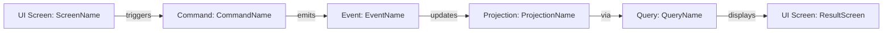
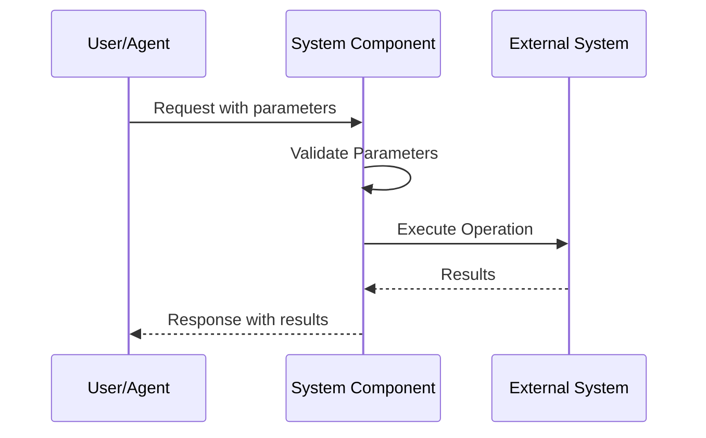
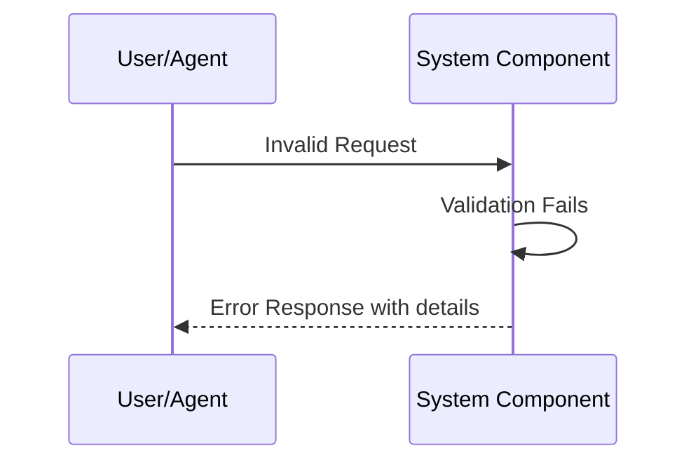
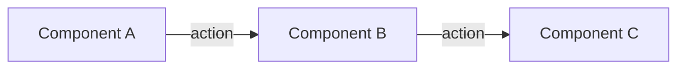
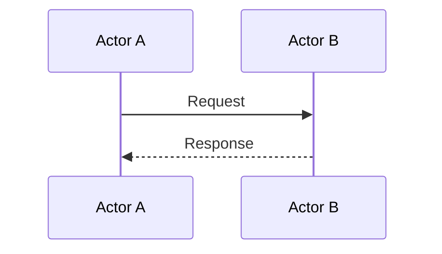

## Overview

This document provides quick-reference templates for creating event model documentation. All templates follow the structures defined in [EVENT_MODELING.md](~/.config/opencode/instructions/EVENT_MODELING.md).

**Purpose**: Agents creating event model documentation can reference these templates for consistent structure and formatting.

**Note**: This is a structural reference. For methodology and process guidance, see [EVENT_MODELING.md](~/.config/opencode/instructions/EVENT_MODELING.md).

---

## Table of Contents

1. [EVENT_MODEL.md Index Template](#eventmodelmd-index-template)
2. [Functional Area Document Template](#functional-area-document-template)
3. [Event Definition Template](#event-definition-template)
4. [Command Definition Template](#command-definition-template)
5. [UI Screen Definition Template](#ui-screen-definition-template)
6. [Automation Definition Template](#automation-definition-template)
7. [Projection Definition Template](#projection-definition-template)
8. [Query Definition Template](#query-definition-template)
9. [Domain Type Definition Template](#domain-type-definition-template)

---

## EVENT_MODEL.md Index Template

**File**: `docs/EVENT_MODEL.md`

```markdown
# Event Model: [ProjectName]

**Document Version:** 1.0
**Date:** [Date]
**Project:** [ProjectName]
**Phase:** 2 - Collaborative Event Modeling

## Overview

[1-2 paragraph description of the project and its event model]

**Key Architectural Insight**: [Critical insight about event model approach]

**Business Value**: [Core business value statement]

## Persistent State Analysis

[Analysis of persistent vs ephemeral state in this system]

**Critical Distinction**: [Key distinction for this project type]

**Architectural Foundation**: [Foundational architectural approach]

## Business Event Models

### Event Model 1: [Event Model Name]

**Business Value**: [What business value this event model provides]

**Vertical Slice Pattern**:
```
(Trigger Component)
  ↓
Command: [CommandName](params)
  ↓
Event: [EventName] OR (NO EVENT - Ephemeral Operation)
  ↓
Projection: [ProjectionName]
  ↓
Query: [QueryName]
  ↓
(Result Component)
```

#### [Diagram Title]

**Success Scenario:**



OR for sequence diagram:



**Error Scenario: [ErrorType]**



**Commands** (User Intentions):
- **[CommandName]**: [Description of what user/system intends]
  - Parameters: [List parameters and their purposes]
  - Purpose: [Why this command exists]

**Events** (Immutable Business Facts):
- **[EventName]**: [What business fact this event records]
  - **NONE** - [If workflow is ephemeral]

**Read Models** (Information Views):
- **[ReadModelName]**: [What information this view provides]
  - Computed from: [Source of data]
  - Contains: [Key data elements]
  - Format: [Structure description]

**Aggregates** (Business Rules):
- **[AggregateName]**: [What business rules this aggregate enforces]
  - Constraints: [List key constraints]
  - Validation: [Validation rules]
  - NO implementation details - business-level validation only

---

[Repeat for each event model]

---

## Integration Points

**[SystemName]**: [Description of integration]
- [Integration details]
- [Communication patterns]
- [Data exchange formats]

[Repeat for each integration point]

---

## Quality Attributes

**[Attribute Name]**: [How this quality attribute is achieved in the design]

[Repeat for each quality attribute]

---

## Event Model Summary

**Total Persistent Events: [N]** [Summary of event count]

**Total Ephemeral Event Models: [N]** [List of workflows]

**Key Insight**: [Critical architectural insight]

**Architectural Implication**: [What this means for implementation]

---
```

---

## Functional Area Document Template

**File**: `docs/event_model/functional-areas/[FunctionalAreaName].md`

```markdown
---
title: "[FunctionalAreaName] Event Models"
---

## Functional Area: [FunctionalAreaName]

### Overview

[1-2 paragraph description of this functional area and its business purpose]

### Workflows

- [Event Model 1 Name](#workflow-1-name)
- [Event Model 2 Name](#workflow-2-name)
- [Event Model 3 Name](#workflow-3-name)

---

### Workflow 1 Name

**Terminal Event**: [EventName] - [What terminal state this workflow reaches]

#### Vertical Slice 1: [SliceName]


**Flow**:
1. User action on [ScreenName][ui-screen] triggers workflow
2. [CommandName][cmd-command] command executes with [parameters]
3. [EventName][evt-event] event emitted with [data]
4. [ProjectionName][proj-projection] projection updated
5. [QueryName][qry-query] query retrieves updated data
6. [ResultScreen][ui-result] displays outcome

#### Vertical Slice 2: [SliceName]

[Repeat pattern for each vertical slice]

[ui-screen]: ../ui-screens/ScreenName.md
[ui-result]: ../ui-screens/ResultScreen.md
[cmd-command]: ../commands/CommandName.md
[evt-event]: ../events/EventName.md
[proj-projection]: ../projections/ProjectionName.md
[qry-query]: ../queries/QueryName.md

---

### Workflow 2 Name

[Repeat pattern for each event model]

---
```

---

## Event Definition Template

**File**: `docs/event_model/events/[EventName].md`

```markdown
---
title: "[EventName] Event"
---

## Event: [EventName]

### Description

[1-2 sentence description of what business fact this event represents]

### Data Fields

| Field Name | Type | Description | Source |
|------------|------|-------------|--------|
| field_1 | [DomainType][type-domaintype1] | [Field description] | Command: [CommandName][cmd-command] |
| field_2 | [DomainType][type-domaintype2] | [Field description] | Command: [CommandName][cmd-command] |
| field_3 | [DomainType][type-domaintype3] | [Field description] | Event Stream: [PriorEvent][evt-prior] |

### Emitted By

- [CommandName][cmd-command]

### Updates Projections

- [ProjectionName][proj-projection]
- [OtherProjection][proj-other]

### Used In Workflows

- [Event Model Name][wf-workflow] in [FunctionalArea][fa-area]

[cmd-command]: ../commands/CommandName.md
[evt-prior]: ./PriorEvent.md
[proj-projection]: ../projections/ProjectionName.md
[proj-other]: ../projections/OtherProjection.md
[wf-workflow]: ../functional-areas/FunctionalAreaName.md#workflow-name
[fa-area]: ../functional-areas/FunctionalAreaName.md
[type-domaintype1]: ../domain_types/DomainType1.md
[type-domaintype2]: ../domain_types/DomainType2.md
[type-domaintype3]: ../domain_types/DomainType3.md
```

---

## Command Definition Template

**File**: `docs/event_model/commands/[CommandName].md`

```markdown
---
title: "[CommandName] Command"
---

## Command: [CommandName]

### Description

[1-2 sentence description of what this command does and why]

### Data Fields

| Field Name | Type | Description | Source |
|------------|------|-------------|--------|
| field_1 | [DomainType][type-domaintype1] | [Field description] | UI Screen: [ScreenName][ui-screen] |
| field_2 | [DomainType][type-domaintype2] | [Field description] | Automation: [AutoName][auto-automation] |
| field_3 | [DomainType][type-domaintype3] | [Field description] | Event Stream: [EventName][evt-event] |
| field_4 | [DomainType][type-domaintype4] | [Field description] | External API: [APIName] |

### Event Aggregation

[If command loads events, describe aggregation logic conceptually]

**Example**:
- Loads all [EventName][evt-event] events for [entity_id]
- Aggregates to compute [computed_field_1] and [computed_field_2]
- Validates [business_rule] before command execution

### Triggered By

- [UI Screen: ScreenName][ui-screen] - via [Button/Action description]

OR

- [Automation: AutomationName][auto-automation] - [condition description]

### Emits Events

- **Success**: [EventName][evt-success]
- **Error**: [ErrorEventName][evt-error] - [error condition description]

OR

- **Error**: [ErrorType] with description - [when this error occurs]

### Acceptance Criteria

#### Scenario: [ScenarioName]

```gherkin
GIVEN [EventName] with field_1="value1", field_2=value2
AND [OtherEvent] with field_x="valuex"

WHEN [CommandName] with param_1="value", param_2=123

THEN [ResultEvent] with result_field="result_value", timestamp="2025-10-09T14:30:00Z"
```

#### Scenario: [ErrorScenarioName]

```gherkin
GIVEN [EventName] with field_1="value1"
AND [constraint violation description]

WHEN [CommandName] with param_1="invalid_value"

THEN [ErrorType] with error_code="CODE", message="Detailed error message"
```

[Include 2-5 scenarios covering happy path and key error conditions]

### Used In Workflows

- [Event Model Name][wf-workflow] in [FunctionalArea][fa-area]

[ui-screen]: ../ui-screens/ScreenName.md
[auto-automation]: ../automations/AutomationName.md
[evt-event]: ../events/EventName.md
[evt-success]: ../events/SuccessEvent.md
[evt-error]: ../events/ErrorEvent.md
[wf-workflow]: ../functional-areas/FunctionalAreaName.md#workflow-name
[fa-area]: ../functional-areas/FunctionalAreaName.md
[type-domaintype1]: ../domain_types/DomainType1.md
[type-domaintype2]: ../domain_types/DomainType2.md
[type-domaintype3]: ../domain_types/DomainType3.md
[type-domaintype4]: ../domain_types/DomainType4.md
```

---

## UI Screen Definition Template

**File**: `docs/event_model/ui-screens/[ScreenName].md`

```markdown
---
title: "[ScreenName] Screen"
---

## UI Screen: [ScreenName]

### Description

[1-2 sentence description of screen purpose and when it's displayed]

### Layout Context

[Describe where screen appears: main window, dialog, sidebar panel, modal, tab, etc.]

**Example**: "Main application window, left sidebar panel, replaces previous content"

### ASCII Wireframe

```
┌─────────────────────────────────────────────────────────┐
│ [ScreenName] Screen Title                               │
│                                                         │
│ ┌─────────────────────────────────────────────────────┐ │
│ │ Section Header                                      │ │
│ │                                                     │ │
│ │ Label 1: [Display Value 1]                         │ │
│ │ Label 2: [Display Value 2]                         │ │
│ │                                                     │ │
│ │ Input Label 1: [_________________]                 │ │
│ │ Input Label 2: [_________________]                 │ │
│ │                                                     │ │
│ │ Dropdown:     [Select Option ▼]                    │ │
│ │                                                     │ │
│ │ [ Cancel Button ]  [ Action Button ]               │ │
│ └─────────────────────────────────────────────────────┘ │
│                                                         │
│ Status: [Status message display area]                  │
└─────────────────────────────────────────────────────────┘
```

### Displayed Data

| Data Element | Source Query | Description |
|--------------|--------------|-------------|
| display_value_1 | [QueryName][qry-query1] | [What this displays] |
| display_value_2 | [QueryName][qry-query2] | [What this displays] |
| computed_value | [QueryName][qry-query1] | [Derived from multiple fields] |

### Input Fields

| Field Name | Type | Description | Validation |
|------------|------|-------------|------------|
| input_field_1 | [DomainType][type-domaintype1] | [Purpose of input] | [Validation rules] |
| input_field_2 | [DomainType][type-domaintype2] | [Purpose of input] | [Validation rules] |

### Triggers Commands

- [CommandName][cmd-command1] - via [Action Button] when [condition]
- [OtherCommand][cmd-command2] - via [Other Action] when [condition]

### User Interactions

- **[Button/Action Name]**: [What happens when user performs this action]
- **[Other Interaction]**: [What happens]

### Used In Workflows

- [Event Model Name][wf-workflow] in [FunctionalArea][fa-area]

[qry-query1]: ../queries/QueryName.md
[qry-query2]: ../queries/OtherQuery.md
[cmd-command1]: ../commands/CommandName.md
[cmd-command2]: ../commands/OtherCommand.md
[wf-workflow]: ../functional-areas/FunctionalAreaName.md#workflow-name
[fa-area]: ../functional-areas/FunctionalAreaName.md
[type-domaintype1]: ../domain_types/DomainType1.md
[type-domaintype2]: ../domain_types/DomainType2.md
```

---

## Automation Definition Template

**File**: `docs/event_model/automations/[AutomationName].md`

```markdown
---
title: "[AutomationName] Automation"
---

## Automation: [AutomationName]

### Description

[1-2 sentence description of what this automation does and why it exists]

### Trigger Conditions

[Describe what initiates this automation]

**Options**:
- **Event-Based**: When [EventName][evt-trigger] event is recorded
- **Time-Based**: [Schedule description] (e.g., "Daily at 2:00 AM UTC")
- **External Webhook**: When [ExternalSystem] sends [webhook type]
- **Condition-Based**: When [condition expression] evaluates to true

### Trigger Logic

[Explain WHY the automation triggers the command - the business logic]

**Example**: "When OrderFulfilled event recorded, automatically trigger SendOrderConfirmation command to notify customer that order has shipped."

### Event Data Used

[If triggered by event, describe what data from the event is used]

| Field from Event | Purpose | Passed To Command |
|-----------------|---------|-------------------|
| field_1 | [How this field is used] | [CommandName].param_1 |
| field_2 | [How this field is used] | [CommandName].param_2 |

### Triggers Commands

- [CommandName][cmd-command] - [condition description]
- [OtherCommand][cmd-other] - [when other condition met]

### Business Rules

[Any business logic the automation implements]

**Example**:
- Only trigger if [condition]
- Skip if [exception case]
- Retry up to N times if command fails

### Used In Workflows

- [Event Model Name][wf-workflow] in [FunctionalArea][fa-area]

[evt-trigger]: ../events/TriggerEvent.md
[cmd-command]: ../commands/CommandName.md
[cmd-other]: ../commands/OtherCommand.md
[wf-workflow]: ../functional-areas/FunctionalAreaName.md#workflow-name
[fa-area]: ../functional-areas/FunctionalAreaName.md
```

---

## Projection Definition Template

**File**: `docs/event_model/projections/[ProjectionName].md`

```markdown
---
title: "[ProjectionName] Projection"
---

## Projection: [ProjectionName]

### Description

[1-2 sentence description of what this projection represents and what information it aggregates]

### Data Table

| Field Name | Type | Description | Source Event | Aggregation |
|------------|------|-------------|--------------|-------------|
| field_1 | [DomainType][type-domaintype1] | [Field description] | [EventName][evt-event1] | LAST |
| field_2 | [DomainType][type-domaintype2] | [Field description] | [EventName][evt-event2] | SUM |
| field_3 | [DomainType][type-domaintype3] | [Field description] | [EventName][evt-event1] | COUNT |
| field_4 | [DomainType][type-domaintype4] | [Field description] | Multiple events | CUSTOM |

### Aggregation Types

- **LAST**: Most recent event value (takes latest [field_name] from [EventName])
- **FIRST**: Initial event value (takes earliest [field_name] from [EventName])
- **SUM**: Numeric sum across events (sums all [field_name] from [EventName] events)
- **COUNT**: Count of events (counts occurrences of [EventName])
- **LIST**: Collection of values (accumulates all [field_name] values in order)
- **CUSTOM**: [Describe custom aggregation logic in detail]

### Custom Aggregation Logic

[If using CUSTOM aggregation, describe the logic]

**Example**: "Computes average order value by summing all OrderLineItemAdded.amount fields and dividing by COUNT of OrderLineItemAdded events for the order_id."

### Updated By Events

- [EventName][evt-event1] - [how this event updates the projection]
- [OtherEvent][evt-event2] - [how this event updates the projection]

### Queried By

- [QueryName][qry-query]
- [OtherQuery][qry-other]

### Used In Workflows

- [Event Model Name][wf-workflow] in [FunctionalArea][fa-area]

[evt-event1]: ../events/EventName.md
[evt-event2]: ../events/OtherEvent.md
[qry-query]: ../queries/QueryName.md
[qry-other]: ../queries/OtherQuery.md
[wf-workflow]: ../functional-areas/FunctionalAreaName.md#workflow-name
[fa-area]: ../functional-areas/FunctionalAreaName.md
[type-domaintype1]: ../domain_types/DomainType1.md
[type-domaintype2]: ../domain_types/DomainType2.md
[type-domaintype3]: ../domain_types/DomainType3.md
[type-domaintype4]: ../domain_types/DomainType4.md
```

---

## Query Definition Template

**File**: `docs/event_model/queries/[QueryName].md`

```markdown
---
title: "[QueryName] Query"
---

## Query: [QueryName]

### Description

[1-2 sentence description of what information this query retrieves and why]

### Parameters

| Parameter | Type | Description | Required |
|-----------|------|-------------|----------|
| param_1 | [DomainType][type-domaintype1] | [Parameter description] | Yes |
| param_2 | [DomainType][type-domaintype2] | [Parameter description] | No |
| param_3 | [DomainType][type-domaintype3] | [Filter/pagination parameter] | No |

### Returns

| Field Name | Type | Description |
|------------|------|-------------|
| field_1 | [DomainType][type-domaintype4] | [Return field description] |
| field_2 | [DomainType][type-domaintype5] | [Return field description] |
| field_3 | List[[DomainType][type-domaintype6]] | [Collection field description] |

### Return Structure

[Describe the structure of the response]

**Single Entity**:
```
{
  field_1: value,
  field_2: value,
  nested_object: {
    nested_field: value
  }
}
```

OR **Collection**:
```
{
  items: [
    { field_1: value, field_2: value },
    { field_1: value, field_2: value }
  ],
  total_count: N,
  page: N
}
```

### Source Projection

- [ProjectionName][proj-projection]

### Query Logic

[Describe any filtering, sorting, or transformation logic]

**Example**:
- Filters projection by [param_1]
- Sorts results by [field_name] ascending
- Paginates with page_size=20
- Only returns records where [condition]

### Used By UI Screens

- [ScreenName][ui-screen]
- [OtherScreen][ui-other]

### Used In Workflows

- [Event Model Name][wf-workflow] in [FunctionalArea][fa-area]

[proj-projection]: ../projections/ProjectionName.md
[ui-screen]: ../ui-screens/ScreenName.md
[ui-other]: ../ui-screens/OtherScreen.md
[wf-workflow]: ../functional-areas/FunctionalAreaName.md#workflow-name
[fa-area]: ../functional-areas/FunctionalAreaName.md
[type-domaintype1]: ../domain_types/DomainType1.md
[type-domaintype2]: ../domain_types/DomainType2.md
[type-domaintype3]: ../domain_types/DomainType3.md
[type-domaintype4]: ../domain_types/DomainType4.md
[type-domaintype5]: ../domain_types/DomainType5.md
[type-domaintype6]: ../domain_types/DomainType6.md
```

---

## Domain Type Definition Template

**File**: `docs/event_model/domain_types/[TypeName].md`

```markdown
---
title: "[TypeName] Domain Type"
---

## Domain Type: [TypeName]

### Description

[1-2 sentence description of what this type represents in the business domain]

### Type Definition

**Base Type**: [String | Integer | Decimal | Boolean | DateTime | UUID | List | Object | Enum]

**Constraints**:
- [Constraint description]

**Constraint Examples**:
- Min length: 3 characters
- Max length: 100 characters
- Pattern: `^[A-Z]{3}-[0-9]{6}$`
- Range: 0.00 to 999999.99
- Time zone: UTC
- Format: ISO 8601
- Allowed values: [value1, value2, value3]
- Must be positive
- Must be non-empty

### Structure

[For Object types, describe the structure]

```
{
  field_1: [Type],
  field_2: [Type],
  nested_object: {
    nested_field: [Type]
  }
}
```

### Example Values

```
"ORD-123456"
"CUST-987654"
"2025-10-09T14:30:00Z"
150.00
true
```

### Validation Rules

[Detailed validation rules for this type]

**Examples**:
- Must start with three uppercase letters
- Must be followed by hyphen and six digits
- Must be unique within system
- Cannot be negative
- Must be valid ISO 8601 timestamp
- Must be in UTC timezone

### Business Rules

[Any business logic associated with this type]

**Example**: "OrderId values are generated by the system on OrderCreated event. Once assigned, an OrderId is immutable and uniquely identifies an order throughout its lifecycle."

### Used In

- [Event: EventName][evt-event] - [which field]
- [Command: CommandName][cmd-command] - [which field]
- [Projection: ProjectionName][proj-projection] - [which field]
- [Query: QueryName][qry-query] - [parameter or return field]

[evt-event]: ../events/EventName.md
[cmd-command]: ../commands/CommandName.md
[proj-projection]: ../projections/ProjectionName.md
[qry-query]: ../queries/QueryName.md
```

---

## Usage Guidelines

### Reference-Style Links

Always use reference-style links at the bottom of documents:

```markdown
See [CommandName][cmd-commandname] for details.
See [EventName][evt-eventname] for event structure.

[cmd-commandname]: ../commands/CommandName.md
[evt-eventname]: ../events/EventName.md
```

### Link Prefixes

Use consistent prefixes:
- Commands: `cmd-`
- Events: `evt-`
- UI Screens: `ui-`
- Automations: `auto-`
- Projections: `proj-`
- Queries: `qry-`
- Domain Types: `type-`
- Workflows: `wf-`
- Functional Areas: `fa-`

### Mermaid Diagram Options

**Simple Flow (Graph LR)**:


**Sequence Diagram**:


### Placeholder Conventions

- `[ProjectName]`: Replace with actual project name
- `[Event Model Name]`: Replace with workflow name
- `[CommandName]`: Replace with command name
- `[EventName]`: Replace with event name
- `[ScreenName]`: Replace with UI screen name
- `[AutomationName]`: Replace with automation name
- `[ProjectionName]`: Replace with projection name
- `[QueryName]`: Replace with query name
- `[TypeName]`: Replace with domain type name
- `[FunctionalAreaName]`: Replace with functional area name
- `[DomainType]`: Replace with specific domain type reference

### YAML Frontmatter

All component documents should include frontmatter with title:

```yaml
---
title: "Document Title"
---
```

### Markdown Formatting

- Use H2 (`##`) for main sections after frontmatter title
- Use H3 (`###`) for subsections
- Use H4 (`####`) for scenarios within sections
- Use tables for structured data
- Use code fences with language specifiers for code blocks
- Use blockquotes sparingly, prefer clear prose

---

## Quick Reference Checklist

When creating event model documentation:

- [ ] Load relevant context from memory (semantic search for patterns)
- [ ] Understand whether system has persistent or ephemeral workflows
- [ ] Create/update EVENT_MODEL.md index with workflow sections
- [ ] Create functional area documents in `docs/event_model/functional-areas/`
- [ ] Create component documents in appropriate subdirectories
- [ ] Use reference-style links consistently
- [ ] Include Mermaid diagrams for all workflows
- [ ] Provide Gherkin acceptance criteria for all commands
- [ ] Define domain types for all fields
- [ ] Cross-link all related components bidirectionally
- [ ] Verify data lineage for all fields
- [ ] Ensure markdownlint compliance
- [ ] Store event model entities in memento with temporal markers

---

## See Also

- [EVENT_MODELING.md](~/.config/opencode/instructions/EVENT_MODELING.md) - Full event modeling process and methodology
- [SYSTEM_PROMPT.md](./SYSTEM_PROMPT.md) - Agent workflow integration context
